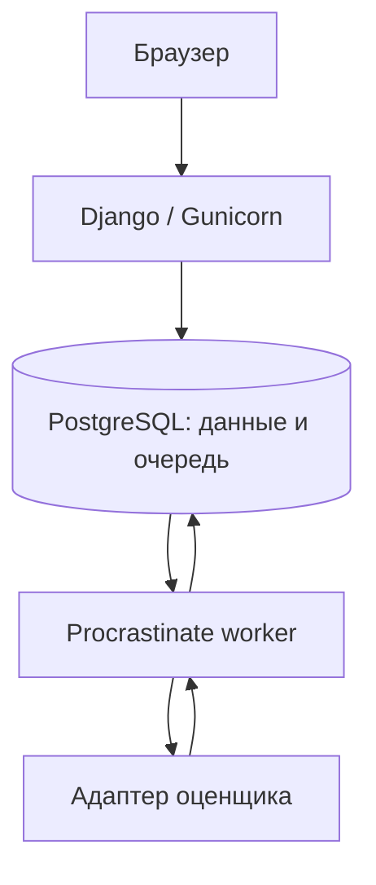

# Устройство проекта

Один Django-проект, одна PostgreSQL, два процесса приложения: HTTP и очередь.
В Docker Caddy раздаёт статику и передаёт запросы Gunicorn. Redis, Node.js и
фронтенд-сборка для запуска не нужны. HTMX включён локальным файлом.

## Что хранится

- `UserProfile` — отображаемый ник и готовый аватар; вход остаётся штатным Django.
- `Exercise` — версия задания: контекст, hard-ответ, обязательные факты,
  допустимые действия и запрещённые обещания.
- `Contest` — сроки, участники, набор заданий, лимит, время, рубрика и призы.
- `Assignment` — дневной слот сотрудника. Уникальность не позволяет создать
  шестое задание обходом интерфейса или повторным запросом.
- `Attempt` — ответ, таймер, статус, текущая оценка. Содержит снимок задания
  и рубрики, чтобы последующее редактирование не меняло условия попытки.
- `Evaluation` — первоначальный результат оценщика. Ручной пересмотр меняет
  текущий результат попытки и `reviewed_skills`; исходная оценка остаётся в базе.
- `EvaluationTrace` — append-only диагностика каждого запуска оценщика: точный
  prompt/параметры, ответ провайдера, нормализованный результат, токены, время
  и безопасное сообщение ошибки. Полный trace доступен сотруднику админки с
  правом view_evaluationtrace и скачивается в JSON или TXT. TXT-выгрузка списка
  учитывает выбранные строки либо текущий фильтр и не загружает всё в память.
- `AuditEvent` — запуск, отправка, изменения администратора, пересмотр и итоги.
- `CalibrationCase` / `CalibrationRun` — эталонные примеры и их прогоны.

## Отправка и восстановление

При открытии сервер создаёт попытку с дедлайном и отложенное задание очереди
в одной транзакции. Повторное открытие возвращает ту же попытку. Черновик
сохраняется через 650 мс после ввода; после ошибки связь проверяется повторно.
Версия черновика защищает от запоздавшего запроса сохранения.

Отправка фиксирует ответ и ставит оценку в очередь в одной транзакции.
Вызов оценщика выполняется вне блокировки базы. Повторный HTTP-запрос и
повторная доставка задания не начисляют баллы второй раз.

После трёх минут принимается только последний черновик, успевший сохраниться
на сервере. Это работает без открытой страницы: отложенная задача завершает
попытку. Раз в минуту служебная задача также ищет просроченные попытки и
работу умерших воркеров. Зависшей считается работа без heartbeat 120 секунд.
Ожидание очереди не входит во время сотрудника.

Временная ошибка оценщика вызывает до трёх проверок с задержкой. После
исчерпания повторов или постоянной ошибки статус — «Нужна проверка»,
оценка остаётся пустой. Администратор может повторить проверку или принять
решение вручную. Сбой сервиса сам по себе не даёт сотруднику ноль.

## Рейтинг

Пять заданий в день по московскому времени. Для всех участников конкурса
на конкретную дату выбирается одинаковый набор и порядок. Повторения между
днями возможны; для демо это намеренное упрощение.

Баллы — сумма оценённых рейтинговых попыток конкурса. Песочница исключена.
Существенное изменение hard-части и пустой ответ дают ноль. Soft-разбор
сохраняется. При равенстве баллов участники делят место. Автоматической
выплаты T-Money нет; призы отображаются как настройки конкурса.

После запуска конкурса его условия заморожены. После окончания приём новых
ответов закрывается. Служебная задача раз в минуту автоматически фиксирует
рейтинг, если все попытки проверены. Если есть очередь или спорная оценка,
конкурс показывает «Подводим итоги» до окончания проверки или ручного решения;
после этого итог фиксируется автоматически либо действием администратора.
Результаты зафиксированного конкурса пересмотреть через интерфейс нельзя.

Досрочное завершение сохраняет фактический момент в Contest.closed_at, оставляя
плановый ends_at для истории. effective_end — более ранний из этих моментов.
Под блокировкой конкурса и попыток таймеры незаконченных работ сокращаются
до effective_end, а сохранённые черновики ставятся в очередь. Сервис не ждёт
API внутри транзакции и не подставляет оценки для ускорения финала.
Порядок блокировок при старте, пересмотре, повторе и закрытии одинаков:
конкурс → попытка. Простое сохранение/проверка блокирует только попытку.

Архивные конкурсы исключены из выбора по умолчанию и доступны отдельно.
В архиве отображается снимок final_standings с датой finalized_at. Новый
конкурс создаёт и активирует администратор; назначенный будущий старт
открывает задания автоматически по времени. Перезапуск seed_demo не меняет
зафиксированный демо-конкурс и не запускает его заново.

## Оценщик и профиль конкурса

В `Contest.rubric` хранятся веса навыков и профиль `evaluator`: провайдер,
модель, версия промпта. Профиль копируется в попытку. Старые рубрики `demo-v1`
без поля `evaluator` всегда выбирают DemoEvaluator, независимо от окружения.
Поэтому включение API не меняет правила уже созданного демо-конкурса.
Новые конкурсы получают профиль из окружения при создании.

`EvaluationInput` содержит только снимок задания, ответ, рубрику и служебные
поля. `LiveEvaluator` отправляет в API только текст задания и ответ, без
служебных ID и личных полей сотрудника. Один HTTP-запрос выполняется стандартной
библиотекой Python, без нового SDK или службы. Хосты API фиксированы; редиректы
запрещены, чтобы ключ не мог уйти другому хосту.

Модель возвращает strict JSON: проверку каждого обязательного факта,
неподтверждённые утверждения с цитатами, пять навыков 0–100, короткие
объяснения, сильные стороны, улучшения и пример ответа. Приложение повторно
валидирует структуру, диапазоны, полноту фактов и наличие цитат в ответе.
Невалидный JSON или выдуманная цитата — техническая ошибка, а не оценка 0.
Структурная валидация не доказывает смысловую точность: её проверяет калибровка.

Итог — взвешенное среднее пяти навыков. Существенная потеря/искажение
обязательного факта или неподтверждённое обещание дают 0. Неоднозначный
hard-вердикт сохраняет разбор, оставляет балл пустым и требует пересмотра.
Пустой просроченный ответ получает локальный 0 без API-запроса.

Ожидание сетевой операции ограничено 60 секундами, размер ответа — 256 КиБ,
генерация — 2400 токенами. Это тайм-аут операции сокета, не абсолютная
гарантия общего времени при медленной передаче частями. Очередь управляет
повторами, внутри адаптера скрытых повторов нет. 429, 5xx, сетевые сбои и
невалидный разбор допускают до трёх попыток. Отказ, проблема ключа или баланса
требуют ручного решения сразу. События содержат ID попытки, тип ошибки,
время, модель и доступные токены. Полные тела запроса и ответа сохраняются
отдельно в `EvaluationTrace` для staff-admin, но не выводятся в stdout и не
содержат API-ключ.

В `Evaluation` хранятся исходный нормализованный разбор, фактическая модель,
версия промпта, расход токенов и длительность. Пересмотр хранит отдельные
навыки в `Attempt`, а причину и значения до/после — в `AuditEvent`.
Ручной повтор API доступен только если разбора ещё нет. Если разбор уже
получен, администратор пересматривает его, сохраняя исходник.

В песочнице «Реальная оценка» использует текущую настройку API. Сценарии
«Успешная тестовая оценка» / «hard-ошибка» / «сбой» всегда идут в DemoEvaluator
и не расходуют API. Обучение модели пока не реализовано; следующая задача —
калибровка на размеченных примерах.

## Роли и версии приложения

Управление пользователями доступно только суперпользователю. Форма предлагает
три роли и синхронизирует штатные группы/права Django. Руководитель получает
просмотр объектов тренажёра и отдельное право `review_attempt`; создание
конкурсов, заданий, пользователей и редактирование прав ему недоступны.
При смене роли прежние группы и индивидуальные права очищаются, чтобы
понижение роли не оставляло скрытый доступ. Последнего активного администратора
нельзя отключить обычным сохранением формы. Удаление пользователей отключено.

Версия интерфейса берётся из первой записи `trainer/releases.py`. Там же
история для `/updates/`; файл CHANGELOG.md повторяет её для чтения из архива,
BACKLOG.md хранит следующие задачи. Query-параметр версии у статики обновляется
вместе с релизом, чтобы браузер не использовал старую тему после сборки.

## Нагрузка

Начальная конфигурация: два HTTP-процесса по два потока и две одновременно
выполняемые задачи очереди. Для разработки с пятью участниками это стартовая
настройка, которую ещё нужно замерить на целевом хосте. Скорость нейросети
может ограничивать очередь независимо от числа открытых страниц.

150 одновременных пользователей — будущая цель, а не подтверждённый результат
теста. Перед таким запуском нужны нативный PostgreSQL, нагрузочный прогон,
метрики времени HTTP/очереди и проверка лимитов выбранного провайдера.
